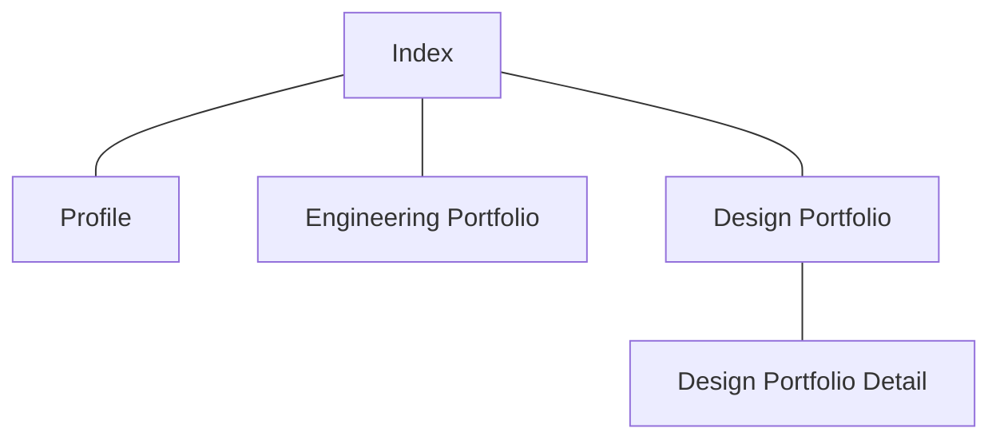

# ポートフォリオ
https://oxmilch.github.io/portfolio/

## 目的
- 今までの経歴、成果などについてポートフォリオとしてまとめ、記す。

## 利用ソフトウェア一覧
- オペレーティングシステム
    - macOS 13 Ventura
    - macOS 26 Tahoe
    - Windows 11 (25H2)
- 開発ソフトウェア
    - [Visual Studio Code](https://code.visualstudio.com/download)
    - [homebrew](https://brew.sh/ja)
    - [git for Windows](https://gitforwindows.org/)
    - [node.js](https://nodejs.org/ja)
        - [Vite](https://ja.vite.dev/)
- プログラム言語等
    - HTML Living Standard
    - CSS 3
    - JavaScript
- デザインソフトウェア
    - Adobe Illustrator 2025 (29.8.4) (mac / win)
    - Adobe Photoshop 2025 (26.11.2) (mac / win)
    - Adobe Premiere Pro 2025 (25.6.3) (mac / win)
- Webサイト公開利用サービス
    - [github](https://github.co.jp/)
- 制作補助サービス
    - [Github Copilot](https://github.com/features/copilot?locale=ja)
    - [Gemini](https://gemini.google.com/app)
    - [Pinterest](https://jp.pinterest.com)

## 開発環境構築
- [macOS](./doc/mac-development-setup.md)
- [Windows](./doc/win-development-setup.md)
- [参考記事URL一覧](./doc/useful-article-link.md)

## サイトマップ

## ワイヤーフレーム
### Index
### Profile
### Engineering Portfolio
### Design Portfolio
### Design Portfolio Detail
