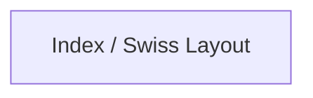
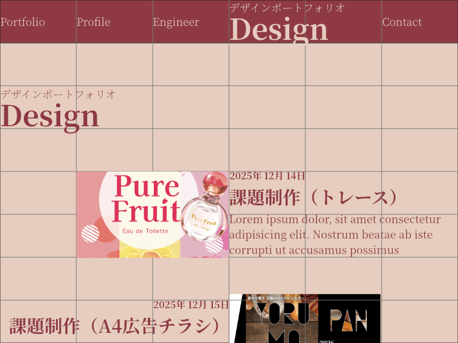

# ポートフォリオ 
https://oxmilch.github.io/portfolio/

## 目的 
- 今までの経歴、成果などについてポートフォリオとしてまとめ記す。

## 利用ソフトウェア一覧 
- オペレーティングシステム
    - macOS 13 Ventura
    - macOS 26 Tahoe
    - Windows 11 (25H2)
- 開発ソフトウェア
    - [Visual Studio Code](https://code.visualstudio.com/download)
    - [Google Antigravity](https://antigravity.google/)
    - [homebrew](https://brew.sh/ja)
    - [git for Windows](https://gitforwindows.org/)
    - [node.js](https://nodejs.org/ja)
        - [Vite](https://ja.vite.dev/)
- プログラム言語等
    - HTML Living Standard
    - CSS 3
    - JavaScript
- デザインソフトウェア
    - [Adobe Creative Cloud](https://www.adobe.com/jp/)
        - Illustrator 2025 (29.8.4) (mac / win)
        - Adobe Photoshop 2025 (26.11.2) (mac / win)
        - Adobe Premiere Pro 2025 (25.6.3) (mac / win)
    - [Affinity3 (mac / win)](https://www.affinity.studio/ja_jp)
- Webサイト公開利用サービス
    - [github pages](https://github.co.jp/)
- 制作補助サービス
    - [Google Gemini](https://gemini.google.com/app)
    - [Pinterest](https://jp.pinterest.com)

## 開発環境構築 
- [macOS](./doc/mac-development-setup.md)
- [Windows](./doc/win-development-setup.md)
- [参考記事URL一覧](./doc/useful-article-link.md)

## ポートフォリオサイト 
### サイトマップ 

### ラフ 
- Index(Desktop Layout)
    - Top  
          
        
    - Profile  
          
        
    - Engineer  
          
        
    - Design  
        
    - Contact  
        
